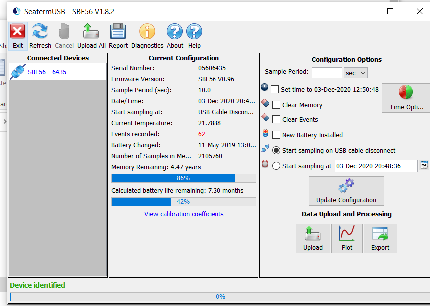
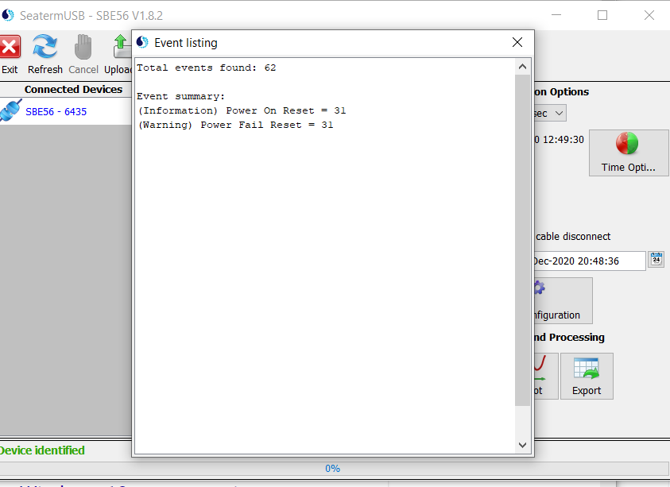

NISKINe Mooring Data Processing
===============================

Python processing files were written in Jupyter notebooks and converted to python scripts using [jupytext](https://jupytext.readthedocs.io/en/latest/). They can be converted back to Jupyter notebooks.

A [conda](https://docs.conda.io/en/latest/) environment with all packages needed for running the python processing scripts can be created by running `conda env create -f environemnt.yml`. The newly created environment will be called `niskine-proc`. It includes the UH `pycurrents` package such that no further manual installation is necessary.

The `Makefile` bundles a number of data synchronization and processing steps. Note that you need GNU make version 4.3 or higher for this to work properly. On Macs, this can be installed via `brew install make` using [homebrew](https://brew.sh/). Type `make help` to see various options for running the Makefile.

### CTD
Need to process cast nearby M1.


### ADCP
All ADCPs have been processed.

Some of the processing code lives in a separate repository at https://github.com/gunnarvoet/gadcp. This interfaces heavily with the [UH pycurrents module](https://currents.soest.hawaii.edu/ocn_data_analysis/installation.html) which is now installed into the `conda` processing environment via `environment.yml`.

All data were recorded as single ping for all instruments. Pings were recorded in bursts. Standard processing parameters used for `gadcp` were
```
min_correlation = 64
max_e = 0.2
pg_limit = 50
```
Single pings were filtered based on correlation and error velocity criteria. Percent good was then calculated for each burst average based on the number of good pings in the average and used for further removing noisy data.

**Magnetic declination** as applied in the processing is about -11.0 which matches a manual run of `magdec`. Now writing the magdec as used in the processing for each ADCP to the netcdf data structure.

The following is a list of ADCPs and for how long they recorded data.
     
|  SN |Mooring|Performance|
|-----|-------|-----------|
| 3109|M1     |Full record|
| 9408|M1     |Full record|
|13481|M1     |Full record; issues with pressure time series|
|14408|M1     |Few days only|
|22476|M1     |Few days only|
| 3110|M2     |Full record|
| 8063|M2     |No data|
| 8065|M2     |Few days only; no pressure|
|10219|M2     |Full record|
|22479|M2     |Few days only|
|23615|M2     |Few days only|
|  344|M3     |No data|
| 8122|M3     |Few days only; no pressure|
|12733|M3     |Few days only|
|15339|M3     |Few days only|
|15694|M3     |Full record|

**SN3109 (M1)** shows a trace of bad data where the top (steel) float was located, about 70m away from the ADCP. We now filter out the data by masking this bin and then interpolate over the gap.

**SN9408 (M1)** has noisy data in bins 6 to about 20 due to fishing long line entangled in the mooring. This matches with notes from the mooring recovery showing long line to about 200m from the instrument. Beam 4 is noisier than beams 1 to 3. We still use the 4-beam solution as otherwise we don't have an error velocity to filter out bad data. A comparison with a 3-beam solution shows that this is the better approach. The percent good limit was increased to 70% for this instrument to filter out more noisy data. This leads to some gaps in the time series, mostly around 150m away from the ADCP, but overall the time series looks good.

**SN14408 (M1)** has a bad beam 2 that has to be masked in the processing, thus there is no error velocity available. Correlation is very low in the deep low-scattering environment and the correlation-based data-filtering is turned off. We thus only rely on a percent good criterion (reduced to 30% good) to filter out questionable data.

**SN8065 (M2)** and **SN8122 (M3)** did not have pressure sensors. We extended the processing code to allow for depth gridding using external pressure time series.

#### Remaining problems 
We still need to work out one issue:
**SN13481** has a full record, however, the pressure time series is not realistic. It does show variations as the nearby pressure time series from other ADCPs but we need to scale it by a factor of about 25 to get to realistic pressure values. We are still in communication with RDI trying to figure out what is going on here. For now, the ADCP time series has been processed with a scaled pressure time series which might in the end be all that we can do.


### Flowquest
Processing done. 

Main issues were to fix the conversion from Instrument velocities to Earth coordinates. See documents in the fq/DocsFromLinkSys on how the "leveled" (E3, in dat files) velocities are converted to Earth coordinates (E4, typically output in dat files). 

Processing is to be run using matlab - 
1) FQ_00_Flowquest_text2mat_NISKINe.m to read in the fq_converted .DAT.txt files and generate the FQ structure which is saved in fq_converted/ called FQ_output.mat. 

2) FQ_01_ConvertInstrument2Earth.m -- 
Since the E4 header was missing in the binary and text files from the niskine deployment (header containing all earth coordinate data), the earth coordinate velocity needs to be calculated by hand using the instructions from LinkSys. Using the conversion in the file "Velocity relationship between leveled instrument coordinate and earth coordinate.doc" found in fq/DocsFromLinkSys/, a new output file with Earth coordinate velocity was added in fq_converted/FQ_output_Earth.mat. 

3) FQ_02_interpolateNewPressure.m -- there is NO PRESSURE sensor in the FQ (confirmed by LinkSys for this S/N). Therefore, the long range ADCP which was moored above the FQ is used to interpolate a realistic pressure. A new (and final) output file is generated from this m-file called: fq_converted/FQ_interpolatedFinal.mat

Final output files: 
* fq/fq_converted/FQ_output --> beam and leveled instrument velocities
* fq/fq_converted/FQ_output_EarthCoords --> conversion to Earth coordinates (with declination correction) as FQ.Earth.VN, .VE and .VW. Note that the E and N vectors are switched because of the opposite orientation of the beams compared to RDI. Output is correct. 
* fq/fq_converted/FQ_InterpolatedFinal.mat --> final output file to be used 

Final figures: 
* fig/M2_CurrentsFull_u.png made by fq/flowquest_mfiles/FQ_interpolateNewPressure.m
* fig/M2_CurrentsFull_v.png made by fq/flowquest_mfiles/FQ_interpolateNewPressure.m


### SBE37
Processing done.

Some of the processing code lives in a separate repository at https://github.com/gunnarvoet/sbemoored.

**2864, 3638, 4922, 4923** worked fine.

**Issues (solved):** **12710, 12711** and **12712** stop sampling at their specified rate pre-maturely. Most likely due to drained batteries - apparently the little tool Seabird provides for calculating instrument endurance isn't that good and one has to be more conservative. The instruments come back to sampling and all of them have data recorded during the time of mooring recovery, but there are gaps in the time series and the time stamps are wrong once data start to drop out. The time series are now cut short at the point where they first start to drop out. The following times for cutting the time series short were determined by comparison with **2864** on the same mooring:
| SN  | last good data |
|-----|----------------|
|12710|2020-02-09 21:00|
|12711|2020-03-17 12:00|
|12712|2020-01-16 23:15|

The clocks of the affected instruments still seemed fine on recovery, time offsets were scaled linearly to the good part of the time series.


### SBE56
Processing done.

Some of the processing code lives in a separate repository at https://github.com/gunnarvoet/sbemoored.

Some of the time series have gaps. The time stamps seem OK. Re-downloading the data files from the affected instruments did not help. Seaterm shows a number of events recorded for the affected instruments, see example for **6435** below:



Clicking the events number brings up the following window:



Seems like there were power issues throughout the deployment that caused gaps in the time series.


### RBR
Processing done.

Some of the processing code lives in a separate repository at https://github.com/gunnarvoet/rbrmoored.


**Issues (solved):** No time offset for **72167**, **76611**. These instruments were downloaded on a computer that misbehaved. Wrong time offset for **72146**, also due to misbehaving computer. Unfortunately, these instruments were not in the included in the clock calibration (warm water dip).
Time offsets for all three instruments (72146: 12s, 72167: 0s, 76611: 10s) were determined by comparison with a few instruments below.

### Moored Profiler w/ Aquadopp

The MP profiled until 2019-12-29 profile #1123 until the battery voltage dropped too much. The MP error log in `raw/ERRORLOG.TXT` shows zero pressure rate and the profiler restarting the profile for most of the profiles. Could this be the stoppers being placed inside the programmed pressure ranges? This might explain the early battery drain. Additionally, not all profiles are full profiles. During times of strong mooring knockdown, the MP had trouble profiling and covered less vertical distance; at times it was even stuck at one depth level.

Data from the SBE52 CTD on the MP have been processed. Something funky happens to the conductivity cell around yearday 290. A few salinity and density profiles are completely messed up, afterwards we see relatively differences between down- and up-casts that were not apparent before this incident.

**Issues:** Velocity range settings on the Aquadopp may render the velocity dataset unusable. More specifically:

1) The time stamps on the Aquadopp velocity profiles do not match up with the moored profiler time stamps. The time between velocity profiles is only about one hour whereas the sampling period of the MP was 4 hours and 45 minutes. The pressure record from the Aquadopp, however, seems to be fine. We should thus be able to line up CTD and velocity profiles using the pressure records. Here the knockdowns actually come in handy as they provide us calibration points to clearly identify matching profiles along the way.

2) Sound speed of the Aquadopp is calculated based on zero salinity. Not sure if this matters?

3) Coordinate system of the data is ENU - it seems like we should have adjusted Aquadopp settings prior to deployment? I think we just initialized it through the MP firmware. Need to look into this for future deployments.

4) Velocity ranges were set to 0.3 m/s for horizontal velocities and 0.13 m/s for vertical velocities. This might be the killer for the velocity dataset. I see lots of velocities seeming to wrap around near these limits.

### Chipod
